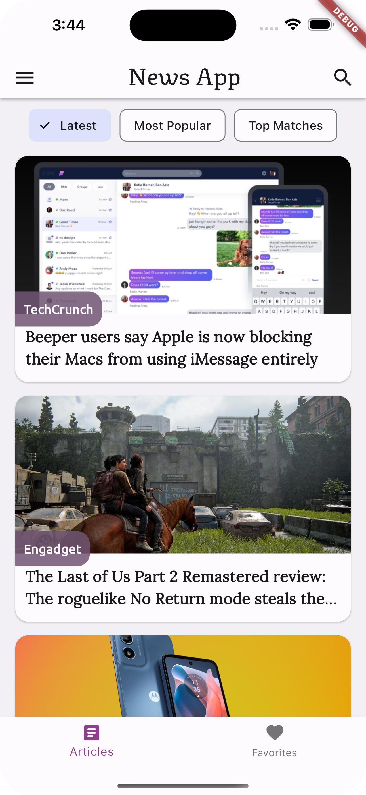
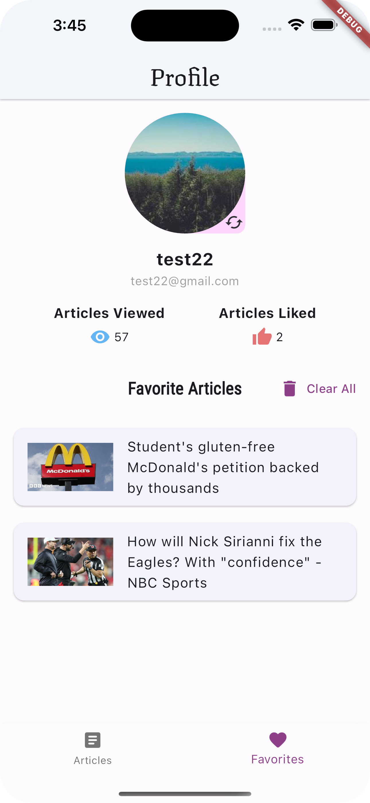

# Flutter News App

Just another news app, built for learning purposes.

## Screenshots

   

The project contains two branches:

- **main** branch: This branch contains the implementation using the newsapi.org API to fetch the latest news articles.
- **with_firebase** branch: This alternative approach uses firebase firestore to store the news articles. The articles are uploaded to the firestore using a python script and a JSON file containing the articles.

## Features

- **Firebase Authentication** : Sign up using email and password
- **Pagination**: The news articles are loaded in batches of 10 articles
- **Filtering** : Filter news by category
- **Search** : Search for news by search term
- **Sorting** : Sort news by date, popularity or relevancy
- **Favorites** : Save news to favorites

- **Avatar Selection** : Select randomly an avatar for your profile
- **Open In Browser** : Open the full news article in the default browser

## Getting Started

### Using the newsapi.org API

1. Create an account on [newsapi.org](https://newsapi.org/).

2. Get your API key.

3. Create a file named '.env' in the root directory of the project (not in the lib folder).

4. Add the following line to the .env file and replace <YOUR_API_KEY> with your API key.

`API_KEY='<YOUR_API_KEY>'`

5. Create a project on [firebase](https://console.firebase.google.com/).

6. Add and enable firebase authentication with email and password.

7. Add and enable firebase firestore (for saving favorite articles).

8. Make sure you have the firebase CLI installed.

9. Run flutterfire configure and connect your app to your firebase project.

10. Run the app.

### Using Firebase Firestore

1. Create a project on [firebase](https://console.firebase.google.com/)

2. Add and enable firebase authentication with email and password.

3. Add and enable firebase firestore.

4. Make sure you have the firebase CLI installed.

5. Run flutterfire configure and connect your app to your firebase project.

6. Use the python scripts provided in the firebase-data-script folder to upload articles to your firebase firestore (Instructions on how to use the script are provided in the script file).

7. Run the app.

